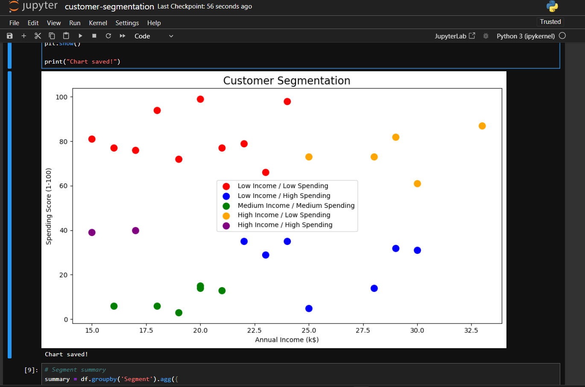

# Customer Segmentation with K-Means Clustering
A machine learning project that segments customers based on their annual income and spending score using the K-Means clustering algorithm.
## Overview
This project applies unsupervised machine learning to identify 5 distinct customer segments, helping businesses better understand their customer base and tailor marketing strategies.
## Technologies
- Python
- scikit-learn
- pandas
- matplotlib
## Results
The model identifies 5 customer segments:
- Low Income / Low Spending
- Low Income / High Spending
- Medium Income / Medium Spending
- High Income / Low Spending
- High Income / High Spending

